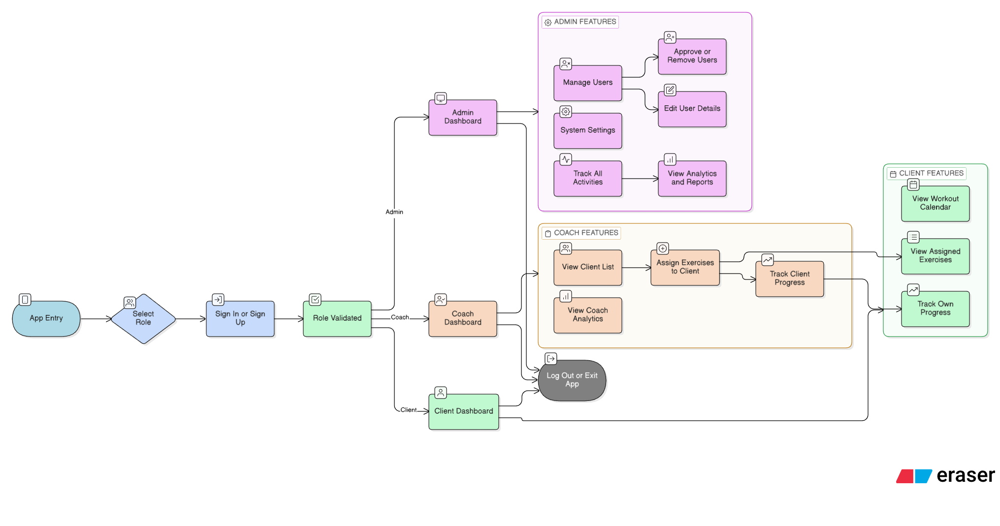

# Gym SaaS

A comprehensive Software as a Service (SaaS) platform designed for gyms and fitness professionals to manage personalized training programs, track client progress, and streamline workout planning. Built with Next.js, this application provides role-based dashboards for clients, coaches, and administrators.

## Architecture Diagram



*Figure 1: High-level architecture of the Gym SaaS platform, showing the flow between frontend, API, database, and external services.*

## Features

- **User Authentication**: Secure registration and login with JWT-based authentication for usders, coaches, and admins.
- **Role-Based Dashboards**:
  - **Client Dashboard**: View personalized workouts, track progress, and access training plans.
  - **Coach Dashboard**: Manage clients, assign workouts, and monitor client activity.
  - **Admin Dashboard**: Oversee the entire platform, manage users, and configure settings.
- **Workout Management**: Fetch and integrate exercises from external APIs, create custom workout plans.
- **Progress Tracking**: Log workouts, track metrics, and view progress over time.
- **Responsive Design**: Modern UI built with Tailwind CSS and Radix UI components.
- **API Integration**: Connects to external exercise databases for a vast library of workouts.

## Tech Stack

- **Frontend**: Next.js 16, React 19, TypeScript
- **Styling**: Tailwind CSS, Radix UI, Lucide React icons
- **Backend**: Next.js API Routes
- **Database**: PostgreSQL
- **Authentication**: JWT, bcrypt for password hashing
- **Forms**: React Hook Form with Zod validation
- **Deployment**: Ready for Vercel or similar platforms

## Installation

1. **Clone the repository**:
   ```bash
   git clone https://github.com/yourusername/gym_sass.git
   cd gym_sass
    ```
2. **Install dependencies**:
   ```
   npm install
   ```
3. **Set up environment variables**:
   Create a `.env` file in the root directory and add the following:
   ```
    DATABASE_URL=your_postgresql_connection_string
    JWT_SECRET=your_jwt_secret_key
    API_KEY=your_external_exercise_api_key
    NEXTAUTH_SECRET=your_nextauth_secret
    NEXTAUTH_URL=http://localhost:3000
   ```
4. **Set up the database**:
   Ensure PostgreSQL is running and create the necessary tables (refer to lib/db.ts for schema).

5. **Run the development server**:
   ```bash
    npm run dev
    ```
    Open [http://localhost:3000](http://localhost:3000) to view the application.

## Usage
 - Landing Page: Visit the home page to learn about the platform and sign up for early access.
 - Registration : Choose between client or coach roles during signup.
 - Dashboards: After login, access role-specific dashboards to manage workouts and clients.
 - API Endpoints: Use the provided API routes for authentication, workout data, and client management.

## API Endpoints
- `POST /api/auth/register`: Register a new user (client or coach).
- `POST /api/auth/login`: Authenticate a user and return a JWT.
- `POST /api/logout`: Log out the user and invalidate the JWT.
- `GET /api/workouts`: Fetch exercises.
- `GET /api/coach/clients`: Get coach's clients
- `GET /api/protected`: Protected route example
  
## Project Structure
     gym_sass/
    ├── app/                   # Next.js app directory
    |  ├── api/
    |  ├── (frontend_page)/
    |  └── globals.css
    ├── components             # Reusable React components
    ├── lib                    # Utilities fntions and services
    ├── public                 # Static assets
    |   └──images
    ├── LICENSE
    └── README.md

## Contributing
1. Fork the repository.
2. Create a feature branch: git checkout -b feature/your-feature-name
3. Commit your changes: git commit -m 'Add some feature'
4. Push to the branch: git push origin feature/your-feature-name
5. Open a pull request.
   
## License
This project is licensed under the MIT License. See the [LICENSE](LICENSE) file for details

## Contact
For questions or support, please open an issue on GitHub or contact the maintainers.

---
*This README was generated to provide a comprehensive overview of the Gym SaaS platform.*
