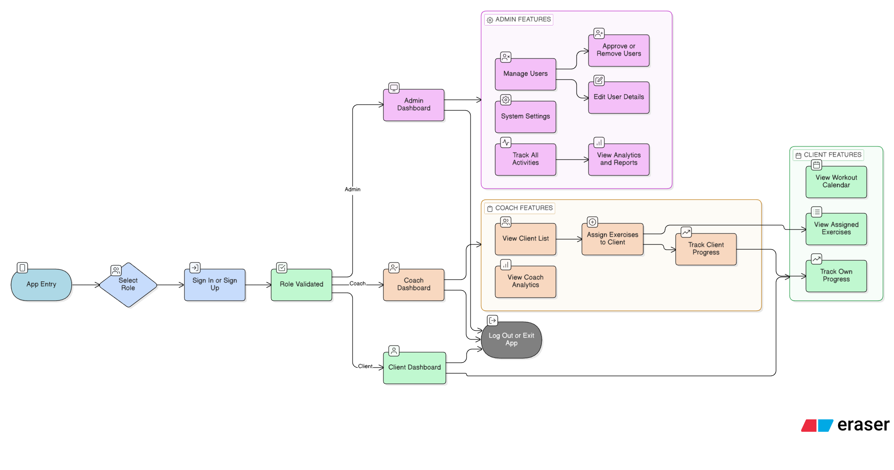

# GymTracker

A comprehensive fitness tracking platform that empowers users to transform their fitness journey through personalized training, progress tracking, and expert coaching. Built with Next.js, this application provides intuitive dashboards for clients, coaches, and administrators.

## Architecture Diagram



*Figure 1: High-level architecture of the GymTracker platform, showing the flow between frontend, API, database, and external services.*

## Features

- **🏋️ Personalized Training**: Custom workout plans tailored to individual goals and fitness levels
- **📊 Progress Tracking**: Comprehensive logging of workouts, measurements, and performance metrics
- **👥 Role-Based Access**:
  - **Client Dashboard**: View workouts, track progress, and communicate with coaches
  - **Coach Dashboard**: Manage clients, create workout plans, and monitor progress
  - **Admin Dashboard**: Oversee platform operations and manage users
- **💬 Communication**: Built-in messaging system for coach-client interactions
- **📱 Responsive Design**: Modern, mobile-first UI built with Tailwind CSS
- **🔒 Secure Authentication**: JWT-based authentication with role-based permissions
- **📈 Analytics & Reports**: Detailed progress reports and performance insights
- **🎯 Goal Setting**: Set and track fitness goals with milestone celebrations

## Tech Stack

- **Frontend**: Next.js 16, React 19, TypeScript
- **Styling**: Tailwind CSS, Font Awesome icons
- **Backend**: Next.js API Routes
- **Database**: PostgreSQL with Prisma ORM
- **Authentication**: Custom JWT implementation
- **Forms**: React Hook Form with validation
- **Email**: Resend for transactional emails
- **Deployment**: Optimized for Vercel deployment

## Installation

1. **Clone the repository**:
   ```bash
   git clone https://github.com/yourusername/gymtracker.git
   cd gymtracker
   ```

2. **Install dependencies**:
   ```bash
   npm install
   ```

3. **Set up environment variables**:
   Create a `.env.local` file in the root directory and add the following:
   ```env
   DATABASE_URL=your_postgresql_connection_string
   JWT_SECRET=your_jwt_secret_key
   NEXTAUTH_SECRET=your_nextauth_secret
   NEXTAUTH_URL=http://localhost:3000
   RESEND_API_KEY=your_resend_api_key
   ```

4. **Set up the database**:
   ```bash
   npx prisma generate
   npx prisma db push
   ```

5. **Run the development server**:
   ```bash
   npm run dev
   ```
   Open [http://localhost:3000](http://localhost:3000) to view the application.

## Usage

- **🏠 Landing Page**: Explore features, read testimonials, and get started
- **📝 Registration**: Choose between Client or Coach roles during signup
- **🔐 Authentication**: Secure login with role-based dashboard access
- **📊 Dashboards**: Role-specific interfaces for managing workouts and clients
- **💪 Workout Logging**: Track exercises, sets, reps, and progress
- **📞 Support**: Contact form, privacy policy, terms of service, and cookie policy

## API Endpoints

### Authentication
- `POST /api/auth/register` - User registration
- `POST /api/auth/login` - User authentication
- `POST /api/auth/logout` - User logout
- `POST /api/auth/forgot-password` - Password reset request
- `POST /api/auth/reset-password` - Password reset confirmation

### Workouts & Exercises
- `GET /api/exercises` - Fetch available exercises
- `GET /api/workouts` - Get user workouts
- `POST /api/workouts/create` - Create new workout
- `GET /api/workouts/history` - Workout history
- `GET /api/workouts/progress` - Progress data
- `GET /api/workouts/sessions` - Workout sessions
- `GET /api/workouts/sessions/[sessionId]` - Specific session details

### Coach Features
- `GET /api/coach/clients` - Coach's client list
- `GET /api/coach/clients/[clientId]` - Specific client details
- `GET /api/coach/reports` - Client progress reports
- `GET /api/coach/stats` - Coaching statistics

### Admin Features
- `GET /api/admin/users` - User management
- `GET /api/admin/stats` - Platform statistics

### Communication
- `GET /api/messages` - User messages
- `GET /api/protected` - Protected route example

## Project Structure

```
gymtracker/
├── app/                          # Next.js app directory
│   ├── (frontend_page)/          # Public pages
│   │   ├── auth/                 # Authentication pages
│   │   ├── contact/              # Contact page
│   │   ├── privacy/              # Privacy policy
│   │   ├── terms/                # Terms of service
│   │   ├── cookies/              # Cookie policy
│   │   └── dashboard/            # Protected dashboard pages
│   ├── api/                      # API routes
│   ├── globals.css               # Global styles
│   └── layout.tsx                # Root layout
├── components/                   # Reusable React components
│   ├── Hero.jsx                  # Landing page hero
│   ├── Navbar.tsx                # Navigation component
│   ├── Footer.jsx                # Footer component
│   ├── Features.jsx              # Features section
│   └── ...
├── lib/                          # Utility functions and services
│   ├── auth.ts                   # Authentication utilities
│   ├── db.ts                     # Database configuration
│   ├── validation.ts             # Form validation
│   └── ...
├── public/                       # Static assets
│   └── images/                   # Image assets
├── prisma/                       # Database schema
├── tailwind.config.ts           # Tailwind configuration
├── next.config.ts               # Next.js configuration
└── README.md
```

## Pages Overview

- **🏠 `/`** - Landing page with features, testimonials, and CTA
- **📝 `/auth/register`** - User registration with role selection
- **🔐 `/auth/signin`** - User login
- **📞 `/contact`** - Contact form and company information
- **🔒 `/privacy`** - Privacy policy
- **📋 `/terms`** - Terms of service
- **🍪 `/cookies`** - Cookie policy
- **📊 `/dashboard/client`** - Client workout dashboard
- **👨‍🏫 `/dashboard/coach`** - Coach management dashboard
- **⚙️ `/dashboard/admin`** - Admin control panel

## Contributing

1. Fork the repository
2. Create a feature branch: `git checkout -b feature/your-feature-name`
3. Commit your changes: `git commit -m 'Add some feature'`
4. Push to the branch: `git push origin feature/your-feature-name`
5. Open a pull request

## Environment Setup

### Required Environment Variables
- `DATABASE_URL` - PostgreSQL connection string
- `JWT_SECRET` - Secret key for JWT tokens
- `NEXTAUTH_SECRET` - NextAuth secret
- `NEXTAUTH_URL` - Application URL
- `RESEND_API_KEY` - Email service API key

### Database Setup
The application uses Prisma ORM with PostgreSQL. Run the following after setting up your database:
```bash
npx prisma generate
npx prisma db push
```

## Deployment

The application is optimized for Vercel deployment:

1. Connect your GitHub repository to Vercel
2. Add environment variables in Vercel dashboard
3. Deploy automatically on push to main branch

## License

This project is licensed under the MIT License. See the [LICENSE](LICENSE) file for details.

## Support

- 📧 **Email**: support@gymtracker.com
- 🐛 **Issues**: [GitHub Issues](https://github.com/yourusername/gymtracker/issues)
- 📖 **Documentation**: [Wiki](https://github.com/yourusername/gymtracker/wiki)

---

**GymTracker** - Transform your fitness journey with personalized training and expert guidance.

---
*This README was generated to provide a comprehensive overview of the Gym SaaS platform.*
